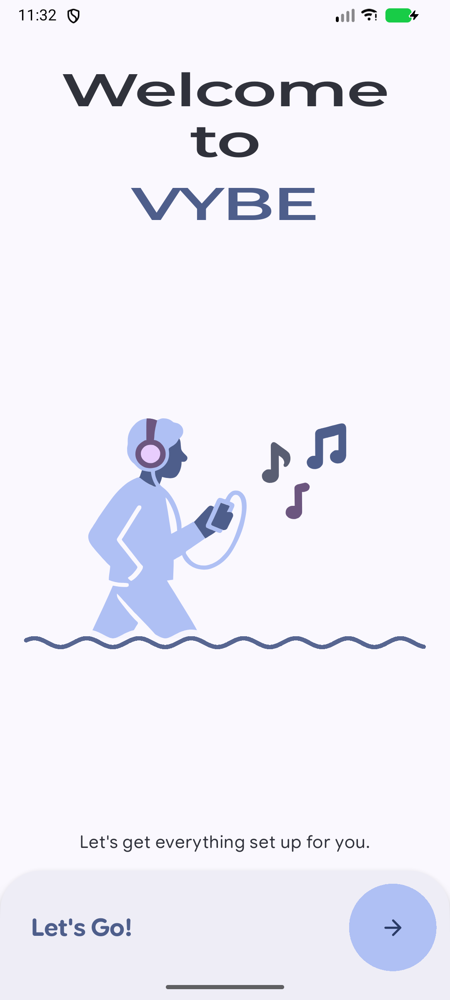
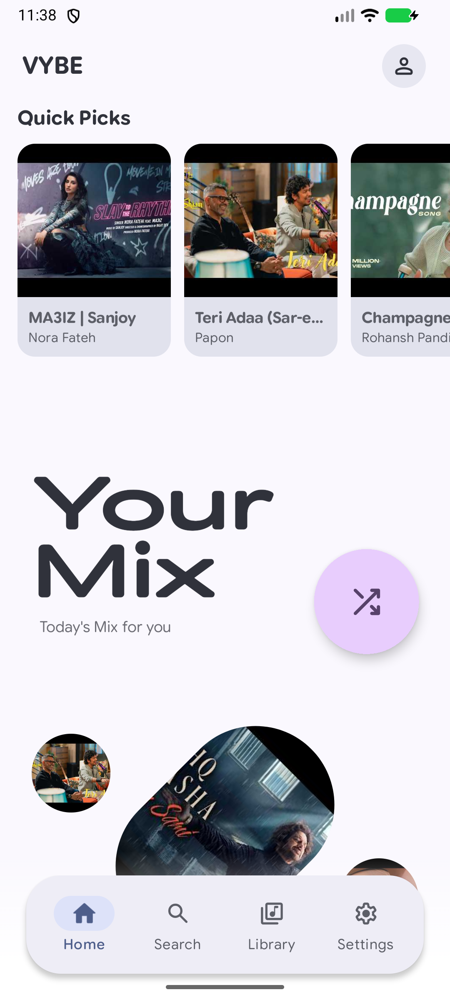
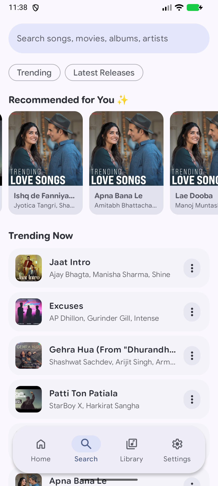
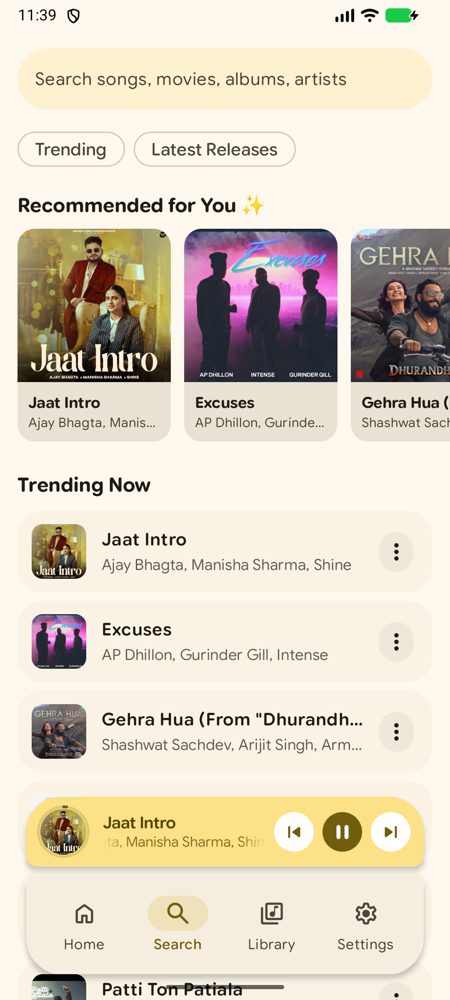

<p align="center">
  
</p>

<h1 align="center">VYBE</h1>

<p align="center">
  A modern Android music experience for discovery, streaming, local playback, downloads, lyrics, and personal listening.
</p>

<p align="center">
  <a href="https://github.com/anshdeepofficial/VYBE/releases/latest"></a>
  
  
</p>

## Experience VYBE

<p align="center">
  
  
  
  
</p>

## What VYBE offers

### Discover and play

- Search songs, albums, movies, and artists through the YouTube Music catalog.
- Explore trending music, latest releases, Quick Picks, and recommendations without signing in.
- Connect a YouTube Music account for playlists, liked music, listening history, and personalized discovery.
- Open artist and album pages directly from search results and the player.
- Stream in the background with Android media controls, queue management, shuffle, repeat, and crossfade.

### Your library, everywhere

- Browse downloads, songs, albums, artists, playlists, folders, and liked music in one library.
- Play music already stored on the device.
- Download supported tracks for offline playback and follow download progress in the app and notification area.
- Import public Spotify playlists from a playlist URL without a Spotify account.
- Optionally sync imported playlists with a connected YouTube Music account.
- Back up and restore app preferences across devices.

### Lyrics and personalization

- Load synchronized lyrics automatically when available.
- Save, edit, translate, or romanize lyrics using a configured AI provider.
- Follow the current lyric line from the player.
- Generate a Daily Mix with AI using your own provider and API key.
- Review listening history and statistics for songs, albums, artists, and genres.

### A player that feels personal

- Material You colors with light, dark, and system themes.
- Customizable navigation, corners, artwork quality, carousel style, and playback behavior.
- Optional immersive artwork with focused cover art and subtle background blur.
- Smooth mini-player progress, artwork transitions, and full-screen playback.
- Configurable notification actions and volume-button playback controls.
- In-app update checks backed by GitHub Releases.

## Download

The current release is **VYBE 0.7.10**.

| Device architecture | APK |
| --- | --- |
| Most modern Android phones (ARM64) | [Download VYBE 0.7.10 ARM64](https://github.com/anshdeepofficial/VYBE/releases/download/v0.7.10/VYBE-v0.7.10-arm64-v8a-release.apk) |
| Older 32-bit ARM devices | [Download VYBE 0.7.10 ARMv7](https://github.com/anshdeepofficial/VYBE/releases/download/v0.7.10/VYBE-v0.7.10-armeabi-v7a-release.apk) |

If you are unsure, choose the ARM64 build. Android may ask to allow installation from your browser or file manager when installing outside Google Play.

## Build from source

### Requirements

- Android Studio with the current Android SDK
- JDK 21
- Git

### Debug build

```powershell
git clone https://github.com/anshdeepofficial/VYBE.git
cd VYBE
.\gradlew.bat :app:assembleDebug
```

On macOS or Linux, run `./gradlew :app:assembleDebug` instead.

The debug APK is written under `app/build/outputs/apk/debug/`.

### Release signing

Release signing credentials must remain local. Never commit a keystore, passwords, API keys, or `keystore.properties` to the repository. Configure the signing values locally, then run the appropriate release task for the required ABI.

## Optional integrations

VYBE works without an account. Features that connect to external services may require their own credentials or user authorization:

- YouTube Music account connection for personalization and synchronization
- AI provider API key for playlist generation and lyric tools
- GitHub repository configuration for in-app update delivery
- Optional cloud or self-hosted music sources exposed in the app

Keep all private credentials outside version control.

## Project notes

- Minimum supported Android version: Android 8.0 (API 26)
- UI: Jetpack Compose and Material 3
- Playback: AndroidX Media3
- Latest published version: 0.7.10 (version code 15)

## Feedback and issues

Found a reproducible problem or have a focused feature request? Open a [GitHub issue](https://github.com/anshdeepofficial/VYBE/issues) with the app version, Android version, device model, and clear reproduction steps.

## License

This repository is distributed under the terms in [LICENSE](LICENSE). Review those terms before using, modifying, redistributing, or publishing the project.

---

<p align="center">
  <strong>VYBE — your music, your way.</strong>
</p>
